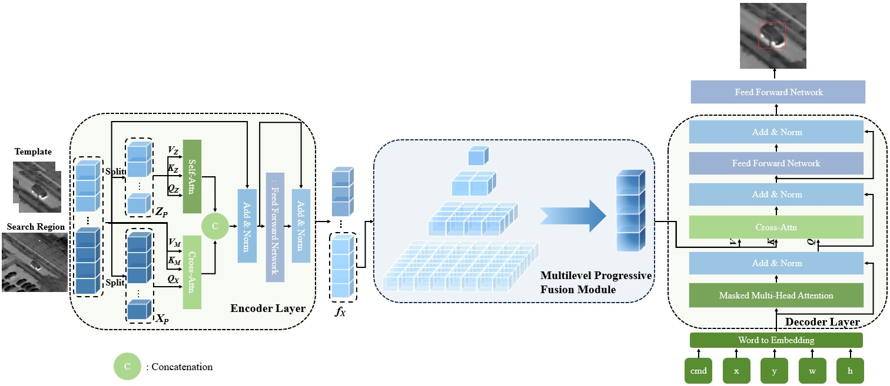

# NLMTrack
This project is the code for "Nature Language Model for Thermal Infrared Tracking."

## Abstract
Thermal infrared tracking is an essential topic in computer vision tasks because of its advantage of all-weather imaging.
However, most conventional methods utilize only hand-crafted features, while deep learning-based correlation filtering methods are limited by simple correlation operations. Transformer-based methods ignore temporal and coordinate information, which is critical for TIR tracking that lacks texture and color information. 
In this paper, we apply natural language modeling to TIR tracking and propose a novel model called NLMTrack, a coordinate sequence generation-based TIR object tracking model. NLMTrack simplifies the TIR tracking pipeline, where the encoder unifies feature extraction and feature fusion, 
and the complex classification and regression heads are discarded. To address the challenge of low detail and low contrast in TIR images, on the one hand, we design a multi-level progressive fusion module that enhances the semantic representation and incorporates multi-scale features. 
On the other hand, the decoder combines the TIR features and the coordinate sequence features using a causal transformer to generate the target sequence step by step. 
Moreover, we explore an adaptive loss aimed at elevaing tracking accuracyand and a simple template update strategy to accommodate the target's appearance variations. Experiments show that NLMTrack achieves state-of-the-art performance on multiple benchmarks.
<figure>
  
  <figcaption style="text-align: center;"></figcaption>
</figure>

<figure>
  
  <figcaption style="text-align: center;"></figcaption>
</figure>
